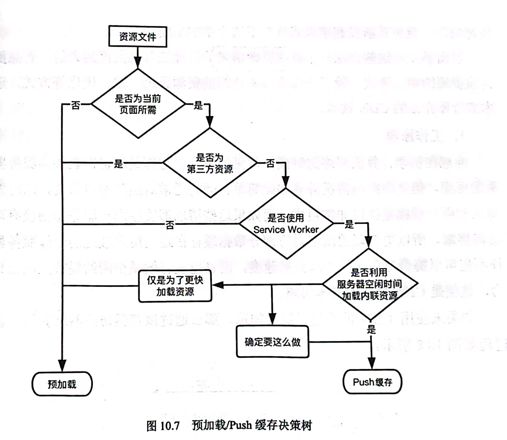

# web前端性能优化 知识点查漏补缺

# 性能评估模型 RAIL
响应（Response）、动画（Animaiton）、空闲（Idle）、加载（Load）

## chrome 多进程浏览器架构


1. 浏览器主进程： 一个浏览器只有一个主进程，负责如菜单栏、标题栏等界面显示，文件访问，前进后退，以及子进程管理等
2. GPU 进程
3. 插件进程：主进程会为每个加入浏览器的插件开辟独立的子进程，并且对它们采用`沙箱模式`
4. 网络进程：负责网络资源加载
5. 渲染进程：也称为浏览器`内核`，默认会为每个标签页开辟一个独立的进程，它包含了多个子线程即 `JS引擎线程、GUI渲染线程、事件触发线程、定时器触发线程、异步HTTP请求线程等`，注意它也被放入沙箱中

- 沙箱模式：不能读取敏感位置数据，也不能在硬盘上写数据，防止了恶意脚本运行

## DNS解析


首先查询`浏览器自身`的缓存，系统自身的 DNS 缓存，hosts文件，本地域名服务器，根域名服务器，顶级域名服务器，权限域名服务器

## tcp 三握手四挥手
三握手
1. SYN seq=t
2. SYN ACK ack=t+1 seq=m
3. ACK ack=m+1

四挥手
1. FIN seq=m
2. ACK ack=m+1
3. FIN seq=n
4. ACK ack=n+1

## 关键渲染路径

字节 -- 字符 -- token(node) -- DOM树

## 第三章 图像优化
位图，可以通过 picture 标签和 srcset 属性提供图像的多个变体
``` html

```
使用 picture 属性可以在多图像文件选择时，获取更多的维度控制，比如`屏幕方向，设备大小，屏幕分辨率`
``` html
<picture>
  <source media="(min-width:800px)" srcset="photo.jpg, photo@2x.jpg 2x">
  <source media="(min-width:450px)" srcset="photo.jpg, photo@2x.jpg 2x">
</picture>
```

### 图像格式
1. jpeg: 基线式(自上而下加载)和渐进式(多次扫描同一个图像文件，首先展示一个低质量模糊的图像，随着扫描到的图像不断增多，每次扫描后所展示的图像清晰度会不断提升)

2. png: 无损压缩的高保真图片格式

3. webP: 尽可能的降低有损压缩和无损压缩，同时还支持透明度和动画

**兼容性处理**：1）前端通过 window.navigator.userAgent 获取版本，再根据兼容情况选择（2）通过 picture 标签选择显示的图像格式

4. svg 矢量图：适合标识 Logo 图标图像，可以无限放大并且不会失真

**优化建议**

（1）保持 SVG 精简，去除注释，隐藏图层和元数据等
（2）因为矢量图本质还是元素点构成位图，因此多了`光栅化`的步骤，建议使用预定义的 SVG 形状
（3）如果使用自定义路径，也少用曲线
（4）不要再 SVG 中嵌入位图
（5）实用工具优化 SVG，通过 svgo-loader 降低定义中的数字精度，缩小文件尺寸
（6）经过 gzip 或 brotli 压缩

5. base64
base64 使用传输 8 位字节码的编码方式，将代表图像的编码直接写入 HTML 或 CSS 中来实现图像的显示

优点：浏览器会自动解析该编码并展示出图像，而无须发起任何关于图像的 URL

缺点： 经过 base64 编码后的图像大小，会膨胀四分之三

格式选择建议：

（1）凡用到图标的场景都尽量使用矢量图
（2）WebP 在相同质量下具有更高的压缩比，且支持动画，优先
（3）考虑兼容性问题，动画可以使用 GIF
（4）对图像有更高分辨率来展示细节且需要透明度时，使用 PNG
（5）追求更高的图像压缩比，使用 JPEG

### 使用建议
（1）雪碧图
使用雪碧图场景：图标不会随用户信息的变化而变化，属于网站通用的静态图标

使用方式：1）通过 background-image 引入雪碧图 URL 2）使用 background-position 定位所需单个图标在雪碧图上的起始位置

不过 HTTP2 中最佳方式是加载单张图片，因为可以在一个 HTTP 连接上发起多次请求

### 总结与技巧
1. 图标等位置优先选用矢量图
2. 使用位图时首选 webP，对不支持的浏览器场景进行兼容
3. 尽量为位图图像格式找到最佳质量设置
4. 删除图像文件中多余的元数据
5. 对图像文件进行必要压缩
6. 对图像提供多种缩放尺寸的响应式资源
7. 对工程化通用图像处理流程尽量自动化

## 第四章，加载优化
首屏以外的图片和视频资源可以通过懒加载实现首屏的快速渲染

（1）监听 scroll 事件和 resize 事件，通过 getBoundingClientRect() 函数获取元素的相对位置
（2）Intersection Observer 当目标元素和设备视窗产生交集的时候，便会触发回调函数
（3）预定义 css 类，通过动态改变类名的方式完成加载
（4）原生的延迟加载属性 loading

视频懒加载：使用 poster 指定图片作为视频延迟加载出现前的占位

### 预加载
preload 属性会强制浏览器进行预加载，不会阻塞 HTML 渲染和 document 的 onload 事件
preconnect 预连接，告知浏览器当前页面将与站点建立连接
dns-prefetch dns预解析
prefetch 让非关键操作能够更早发生
预提取场景：（1）电商平台搜索框搜索时，预提取`商品详情页`（2）搜索查询时，预提取结果分页的`下一页`内容

### 加载方面总结
1）尽快呈现给用户尽可能少的必备资源
2）充分利用系统或带宽的空闲时机，来提前完成用户稍后可能会进行的操作过程或加载将要请求的资源文件


## 第六章 构建优化
### 压缩与合并
资源合并与压缩（1）减少HTTP请求数量（2）减少HTTP请求资源大小

文件合并的优劣势：
1. 多个文件合并成一个，不怕发生请求阻塞
2. 合并之后如果把`首屏渲染`的文件也合并进来，会影响效率
3. 缓存会失效，即使是对其中一个文件的小改动也会使得该`缓存失效`

**使用建议**

对公共库合并，一般公共库的修改频率比较低

业务代码按照不同页面进行合并，即当被路由请求到的页面才加载对应页面的资源

Node CommonJS、RequireJS AMD、国内提出的 CMD

### webpack 性能优化
1. include exclude 在尽可能小的范围内减少执行 Loader
2. resolve 参数处理扩展名和依赖
3. DLLPlugin 会把第三方库单独打包到一个文件中，作为一个依赖，不会和项目一起重新打包，只有依赖自身发生版本变化时才会重新进行打包
4. 通过 happypack 充分释放 cpu 把打包构建任务分解成多个子任务去并发执行
5. 压缩打包代码：（1）tree-shaking 分析每个模块是否被真实使用，对没用到的包进行剔除（2）对css 和 js 压缩过程中的 console.log 和注释语句通过 `uglifyjs-webpack-plugin`
6. 拆分代码按需加载，根据路由划分打包文件，访问到不同路由再触发回调请求打包文件
7. webpack-bundle-analyzer 对 webpack 中的统计类实例 Stats 调用 toJson 方法，再提取出各个 chunks 包的大小信息，最后 Canvas 进行画图

## 第七章 渲染优化
### 计算样式优化
1. css 匹配规则是从右到左的
（1）使用类选择器代表标签选择器
（2）避免使用通配符做选择器
（3）降低选择器的复杂性
#### BEM 规范
2. B（block）E（element）M（modifier），理论上通过它希望每行 css 代码只有一个选择器
- \-仅作为连字符使用，表示多个单词之间的连接符
- _作为状态的描述
- __块与块之间的连接

### 页面布局和重绘优化
- 触发页面布局和重绘的操作
1. 对 DOM 元素几何属性的修改
2. 对 DOM 树结构修改
3. 获取某些特定属性值的操作

- 使用类名对样式统一修改，即对某个块通过添加类名的方式完成。
- 缓存对敏感属性值的计算（例如 offsetTop offsetLeft，循环中如果每次都用到就会强制熟重绘并重新求值，影响重绘性能）。
- 使用 requestAnimationFrame 控制渲染帧，注意要先读再写，因为先写再度也会强制重绘页面再求值，是损失性能的。

## 第八章 服务器端渲染
多层次优化方案：
（1）构建层模板编译（把模板编译工作提前到 webpack 的构建阶段）
（2）预渲染数据无关的页面
（3）服务器端的渲染

前端同构：同样的代码在服务器端和浏览器端都各执行一次

1. 如何获取到样式信息的字符串形式 （）
2. 如何统一处理所有子组件的数据存储（高阶组件封装）

## 第九章 数据存储
根据操作是否会阻塞当前活动线程的执行，可以将存储方式分为同步或异步

文件系统、WebSQL 和 IndexedDB 都是`异步`方式，而本地存储的 LOcal Storage 和 Session Storage 方式则是`同步`的。

LocalStorage 和 SessionStorage 中仅能存储字符串内容，所以当要存储对象和数组等复杂数据类型时，需要使用 JSON.stringify 先将其转化为字符串

WebSQL 可以处理复杂的关系型数据，openDatabase()、transaction()、executeSql()

IndexedDB
1. 存储空间大，indexDB 一般来说不会少于 250MB，甚至没有上限
2. 支持事务，即满足事务操作所要求的原子性
3. 支持多种数据模型，包括对象、字符串还可以是二进制数据
4. 同源约束：只能访问自身域名下的数据库，不能跨域访问
5. 异步，indexedDB 数据操作不会阻塞浏览器主线程

cookie
1. HttpOnly：cookie 信息只能放在 HTTP 中使用，无法通过 JavaScript 修改
2. Secure：只能通过 HTTPS 协议加密过的请求进行发送，但是即便如此也不建议在 cookie 中传输敏感信息
3. SameSite：控制某个 Cookie 在跨站请求时能否被发送

## 第十章 缓存技术
no-cache：不去判断是否过期，直接与服务器协商验证缓存有效性
no-store：禁止使用任何缓存策略
private：只能被浏览器缓存
public：即可以被浏览器缓存，又可以被代理服务器缓存
s-maxage：代理服务器缓存过期时间

强制缓存响应速度较快，但是很难进行及时更新，而协商缓存则反过来

1. 比如 html 文件为主文件，为了保证其内容修改时能及时更新，应当将其设置为协商缓存，cache-control: no-cache
2. 对于图片文件，因为图片内容基本都以修改为主，且考虑到图片文件的数量和大小，一般设置成强制缓存且过期时间不宜过长
3. 样式文件，通过在文件后添加`文件指纹`，使用强制缓存设置较长过期时间，当文件发生改变时候既能及时响应同时又能使用强制缓存较快响应
4. js 文件和 css 文件类似，但是可能设计部分敏感信息的处理，可以设置缓存属性为 private

### Service Worker 概览
1. 独立于浏览器主线程，无法直接操作 DOM
2. 开发过程中通过 localhost 但是线上环境需要 HTTPS 支持
3. 拦截全站的网络请求，从而自定义请求响应控制
4. 在不使用的时候会被中止，需要的时候会重新启动，所以不能依赖在 Onmessage 和 onfetch 事件监听处理程序中的全局状态，可以通过 indexedDB API 进行全局状态存储
5. 广泛使用 Promise 处理异步
6. 消息推送
7. 后台同步

push 缓存和预加载


### CDN
提升`首次请求`的响应速度，需要使用到 CDN

一般使用 CDN 的一些特点：访问频率高，承载流量大，更新频次低与业务没有太多耦合

CDN 域名设置: 一般静态资源和主域名会分开，（1）对静态资源的请求不会携带不必要的 cookie 信息（2）考虑浏览器对同一域名下并发请求的限制

## 第十一章 性能检测!
1. 常见的检测工具：chrome 中的 Coverage面板：统计代码执行的覆盖率情况

可以将首屏渲染阶段暂时没有执行到的代码部分单独打包，延迟按需加载

性能指标的六个关键数据（现为4个）：首次内容绘制时间（FCP）、速度指数、可交互前的耗时（TTI）、首次输入延迟（FID）
1. 首次内容绘制时间（FCP）：浏览器首次呈现出 DOM 元素内容所花费的时间，DOM 内容包括文本、图像、SVG 或非空白的 `<canvas> `标签，但 iframe 中的内容绘制并不会考虑在内
2. 速度指数：检测并捕获页面加载过程中每一帧之间的视觉变化进度，通过 `speedline` 模块包生成相应的评估得分
3. 可交互前的耗时（TTI）：页面完成交互时间
4. 首次输入延迟（FID）：用户`首次交互`到浏览器给出实际响应的时间