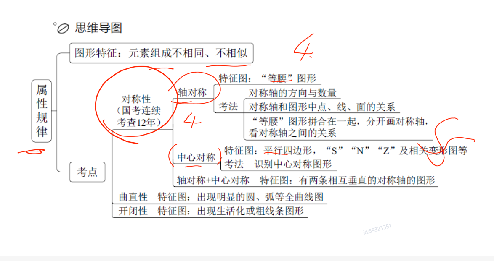
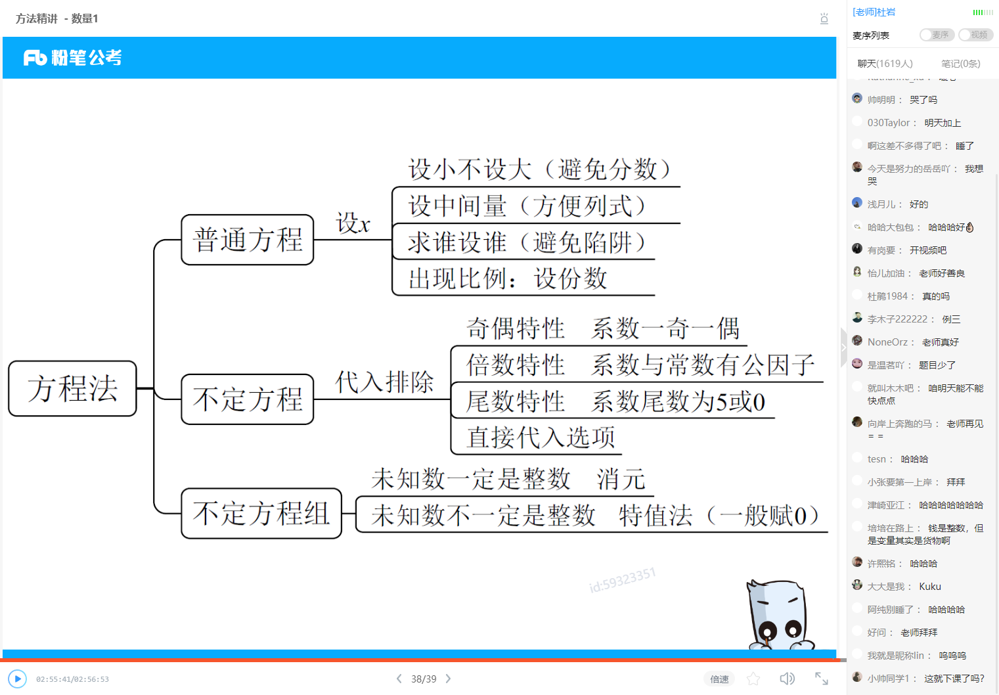

1. 主要、主旨、主题、观点、意在、想要、概括、关键词、主题词

有中心句：替换 推演
无中心句：全面概括

1. 抓程度词
2. 贴近中心句 + `形象化`表达 优选

语言1

## 数量

## 判断

对称轴：
1. 对称轴方向数量
2. 对称轴和图形的点线面关系
3. 等腰拼接 看对称轴的关系

中心对称：`SNZ`或者`风车`

曲直性：出现明显的圆、弧等图形 （`同心圆`）
开闭性：`生活化`图形

### 特殊关系
`两个或多个封闭图形连接在一起`
相交于点、相交于线、相交于面 （相交数量）

没法画轴看图形间的东西（标记的是直角锐角，面的大小，交点是直线圆弧的交点还是）

## 资料
一步除法 截分母
多部除法 分子分母都截
差距大，截两位；差距小，截三位
如果存在倍数关系需要带量级，即116.6 -> 120

一大一小直接比较
同大同小：竖着直接除，看是否大于1
横向看倍数，分子倍数大，则该数大
分母倍数大，则该数小